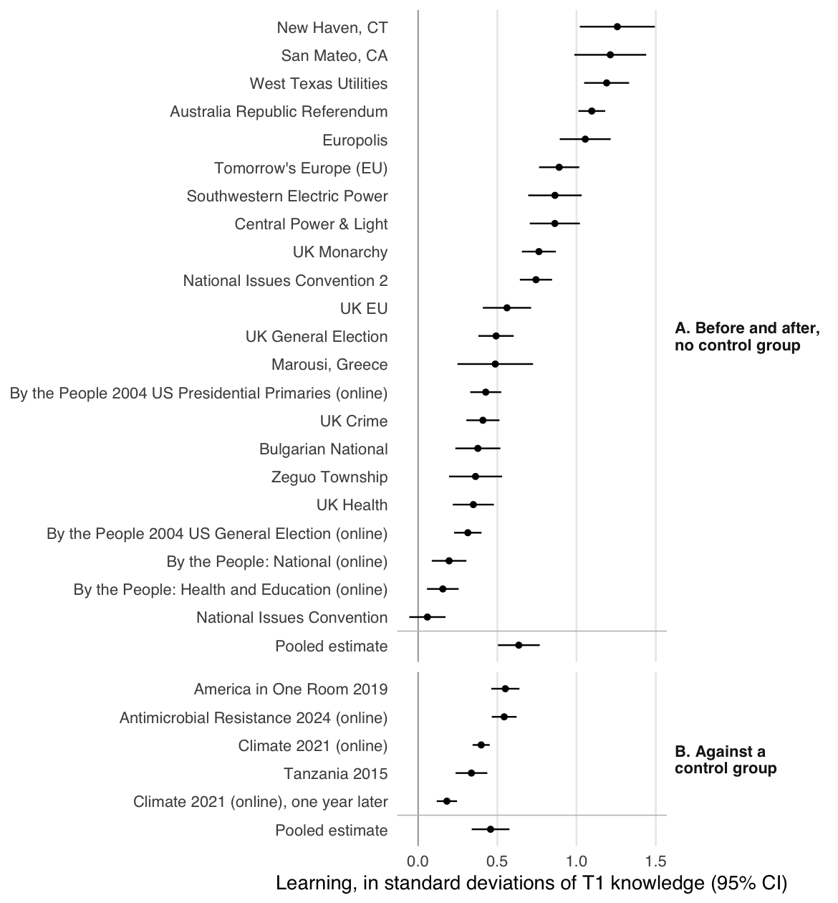

# Deliberation and Learning: Evidence From Deliberative Polls

Robert C. Luskin, Gaurav Sood, and James S. Fishkin

Who learns how much in a Deliberative Poll, and does deliberating cause the learning?

**[Read the manuscript](ms/main.pdf)** · [Editable source](ms/main.Rmd) · [Recodes](docs/recode_ledger.csv) · [The polls](docs/polls.csv)

## Findings

- **Participation causes learning.** In four Deliberative Polls with control groups (America in One Room 2019, its 2021 climate successor, Tanzania 2015, and the 2024 poll on antimicrobial resistance in six countries), participating raised factual knowledge by .46 SD [.34, .58]. A year after the climate poll, 45% of the effect remained. [Estimates](tabs/control_effects.csv)
- **Every poll shows learning.** Across 22 polls without controls, the share of items answered correctly rose by .130 [.099, .162], about twice as much face to face as online. [Poll gains](tabs/poll_gains.csv)
- **Who learns.** Participation helps those who start out knowing less, and those without degrees, somewhat more. Small groups are composed as if at random, and groupmates' knowledge has no detectable effect on learning. [Models](tabs/models.csv) · [peer effects](tabs/peer_effects_pooled.csv)



## Data

| Source | Contents | DOI |
|---|---|---|
| Luskin, Sood, Fishkin and Hahn (2022) | Participant-level scores, 21 polls | [10.7910/DVN/D7G1LO](https://doi.org/10.7910/DVN/D7G1LO) |
| Cor and Sood (2016) | Item-level responses, 23 polls | [10.7910/DVN/HZHVCU](https://doi.org/10.7910/DVN/HZHVCU) |
| America in One Room (2019) | Attendees and uninvited control | [10.7910/DVN/KJ8IH2](https://doi.org/10.7910/DVN/KJ8IH2) |
| America in One Room: Climate (2021) | Attendees and uninvited control, three waves | [10.7910/DVN/IIOG1S](https://doi.org/10.7910/DVN/IIOG1S) |
| Sandefur et al. (2022), Tanzania | Village-randomized experiment | [10.7910/DVN/S3NRQL](https://doi.org/10.7910/DVN/S3NRQL) |
| Mendelson et al. (2026), Antimicrobial Resistance | Randomized; attendees vs controls, six countries | [10.25740/sb639ms2957](https://doi.org/10.25740/sb639ms2957) |
| Marousi, Greece (2006) | Participant-level scores, first released here | `data/raw/greece.csv` |

All are CC0 except the antimicrobial-resistance data (CC BY 4.0). The Distortions, Cor–Sood and Greece files are in `data/raw/` and checked by MD5. The four control-group files are downloaded into the ignored `data/cache/` and checked against the SHA-256 hashes in [`data/control_files.csv`](data/control_files.csv).

## Reproduce

R packages are pinned in `renv.lock`; the paper also needs Pandoc and XeLaTeX.

```sh
make restore
make check
```

`make check` rebuilds the analyses, figures and manuscript, then runs linting and tests. The tests compare results with published numbers from independent sources: Cor and Sood's learning estimates, the published America in One Room results, Sandefur et al.'s treatment effects, and the antimicrobial-resistance sample sizes.

## Layout

| Folder | Contents |
|---|---|
| `data/` | Raw inputs and the download manifest for the control-group studies |
| `R/` | Functions: reading and checking sources, measures, models, meta-analysis, figures style |
| `scripts/` | `run_all.R` builds `tabs/`; `figures.R` builds `figs/` |
| `tabs/`, `figs/` | Generated tables (CSV) and figures |
| `ms/` | Manuscript source, bibliography and PDF |
| `docs/` | The poll list and the recode ledger |
| `tests/` | Numerical checks against published results |
